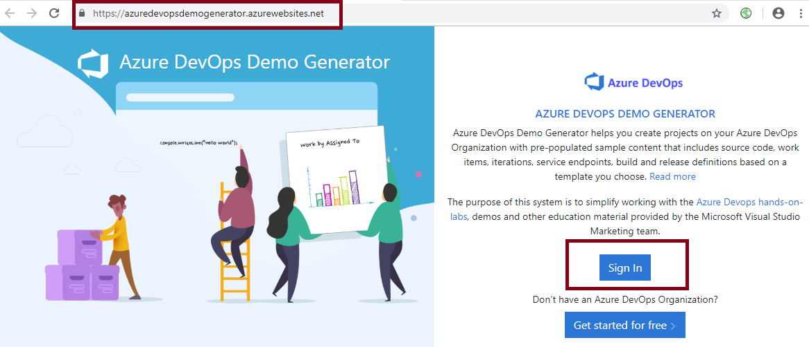
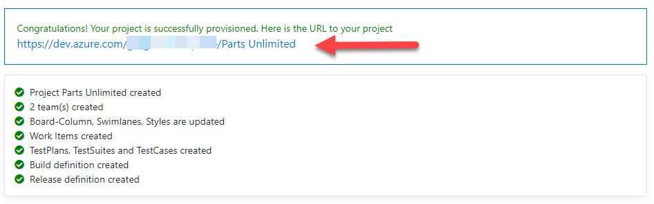

We highly recommend that you complete the assigned hands-on lab work. To do the hands-on labs, you will need to complete the following steps. 

1. Sign up for a free [Azure DevOps account](https://www.azuredevopslabs.com/). Use the Sign up for a free account button to create your account. If you already have an account proceed to the next step.

2. Sign up for free [Azure Account](https://azure.microsoft.com/en-us/free/). If you already have an account proceed to the next step.

3. To make it easier to get set up for testing Azure DevOps, a [Azure DevOps Generator Demo](https://azuredevopsdemogenerator.azurewebsites.net/) program has been created. Click the **Sign In** button and sign in with your Azure DevOps account.

4. You will then be asked to confirm that the generator site can have permission to create objects in your Azure DevOps account. 

5. If you agree, click the **Accept** button and you should be greeted by the Create New Project screen:

6. Select the appropriate organization (if you have more than one) and enter **Parts Unlimited** as the **New Project Name**, then click the ellipsis to view the available templates. These will change over time but you should see a screen similar to the following:

7. From the **General** tab, choose **PartsUnlimited**, then click **Select Template**.

8. Now that the Create New Project screen is completed, click **Create Project** to begin the project creation phase.

9. When the project is successfully completed, click the link provided to go to your team project within Azure DevOps.

✔️ Note that because Azure DevOps was previously called VSTS (Visual Studio Team Services), some of the existing hands-on labs might refer to VSTS rather than Azure DevOps.  