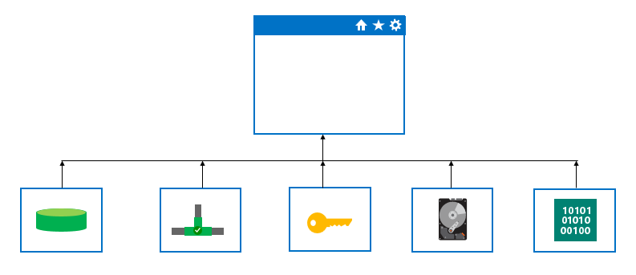

When architecting automation solutions, how the various components that define your enviroment are structured or referenced, such as text files, definitions, scripts etc can be important. If the automation components are developed and used in an ad hoc manner, over time as your applications and environments change and complexity increases, it can become more difficult to manage, maintain and troubleshoot your automation files.

For small to medium solutions, with small teams, having single files to define your application resources and configuration, can be fine and may be easier to understand and maintain. It is possible to see all the resources and values in a single file, so there can be benefits to this scenario. However, for advanced or more complex scenarios, breaking your automation resources into their constituent parts is of major benefit. This can be referred to as **modularization**, or modularizing your automation assets into their component parts, which collectively define the environment and configuration for your application.

You can break up your automation assets into their own logical parts such as databases, networks, storage, security, operating systems and other components.

Benefits of modularization include:

- Easier to re-use components across different scenarios
- Easier to manage and maintain you code
- Easier for new team members to ramp up and understand how infrastructure and components relate and are used
- Easier to sub-divide up the work and responsibilities across teams and area owners
- Easier to troubleshoot
- Easier to extend and add to your existing infrastructure definitions
