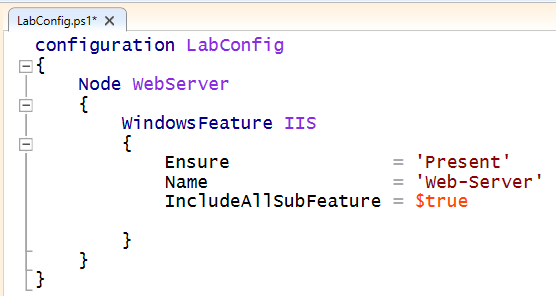

DSC configurations are Windows PowerShell scripts that define a special type of function. Review this [simple configuration](https://msdn.microsoft.com/en-us/powershell/dsc/configurations#configuration-syntax).

The **Configuration** block is the outermost script block. In this case, the name of the configuration is **LabConfig.** Notice the curly brackets to define the block.

There can be one or more **Node** blocks. These define the nodes (computers and VMs) that you are configuring. In this example, the node targets a computer called **WebServer**. You could also call it **localhost** and us it locally on any server.

Lastly, there can be one or more [resource blocks](https://msdn.microsoft.com/en-us/powershell/dsc/builtinresource). This is where the configuration sets the properties for the resources. In this case, there is one resource block called **WindowsFeature.** Notice the parameters that are defined.

<table border="0" cellpadding="0">
<tbody>
<tr>
<td width="15%"> 

 </td>
<td valign="top"> 

You can create the configuration in any editor, such as the PowerShell ISE. Save the file as a PowerShell script with a ps1 file type.

 </td>
</tr>
</tbody>
</table>

