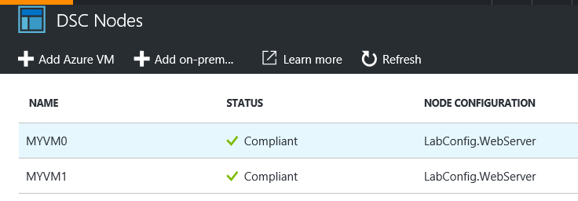
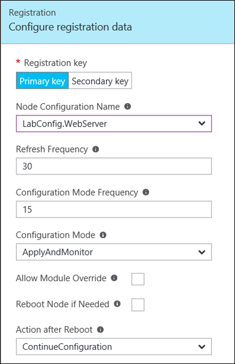

After your configuration is in place, you will select the Azure virtual machines or [on-premises virtual machines](https://docs.microsoft.com/en-us/azure/automation/automation-dsc-onboarding#physicalvirtual-windows-machines-on-premises-or-in-a-cloud-other-than-azureaws) that you would like to onboard.

For each machine, you will need to [configure the registration data](https://azure.microsoft.com/en-us/documentation/articles/automation-dsc-onboarding/#azure-virtual-machines).

<table width="115%">
<tbody>
<tr>
<td width="55%">

          

</td>
<td width="43%">

Node Configuration Name. DSC configuration that will run on this node. Your configuration should show in the drop-down.

Refresh Frequency. Represents the frequency in minutes at which the PS DSC Local Configuration Manager contacts the Azure DSC pull server to download the latest node configuration.

**Configuration Mode Frequency. Represents the frequency in minutes at which the background application of DSC attempts to implement the current node configuration on the target node.**

Configuration Mode. Specifies how the Local Configuration Manager applies the configuration to the target nodes. **ApplyandMonitor** is the default. For other options, see [Basic Settings](https://msdn.microsoft.com/en-us/powershell/dsc/metaconfig#basic-settings).

Allow Module Override. Controls whether new configurations downloaded from the Azure Automation DSC pull server are allowed to overwrite the old modules already on the target server.

Reboot Node if Needed. Reboot the server if the configuration requires.

Action after Reboot. There are two choices, **ContinueConfiguration** and **StopConfiguration**.

</td>
</tr>
</tbody>
</table>
