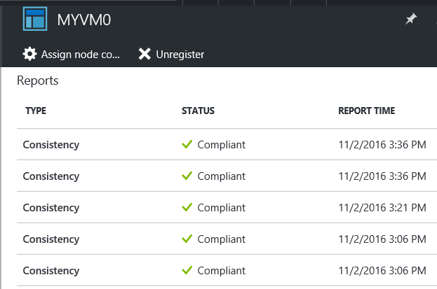

Each time that Azure Automation DSC performs a consistency check on a managed node, the node sends a status report back to the pull server. You can [view these reports](https://azure.microsoft.com/en-us/documentation/articles/automation-dsc-getting-started/#viewing-reports-for-dsc-nodes) on the blade for that node.

  
Notice that you can also **Unregister** the node and **Assign** a different configuration to this node. For more information, see [Troubleshooting DSC](https://msdn.microsoft.com/en-us/powershell/dsc/troubleshooting).
